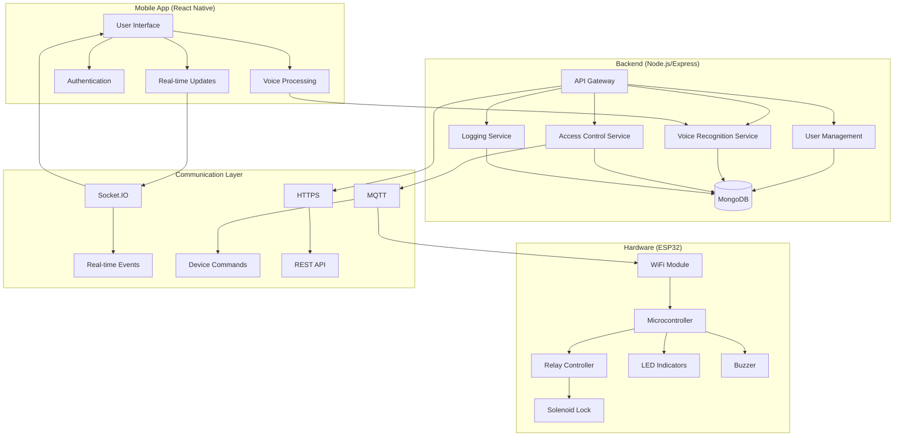
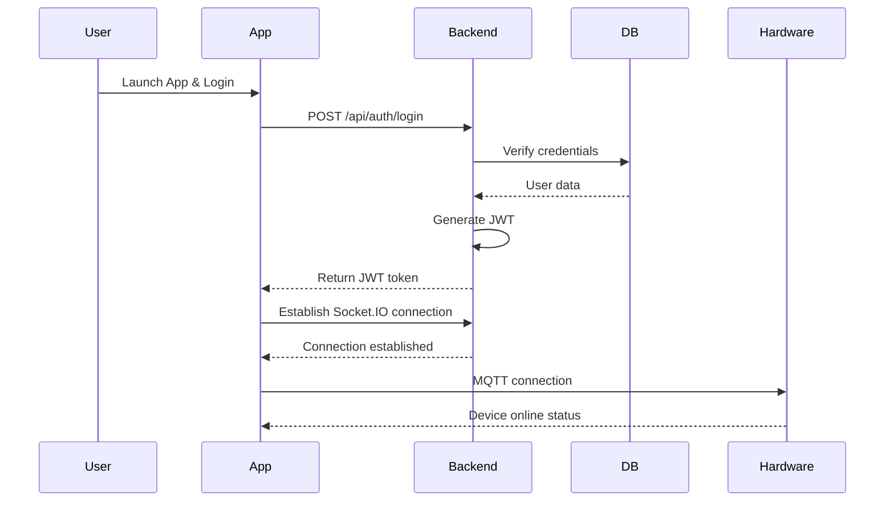
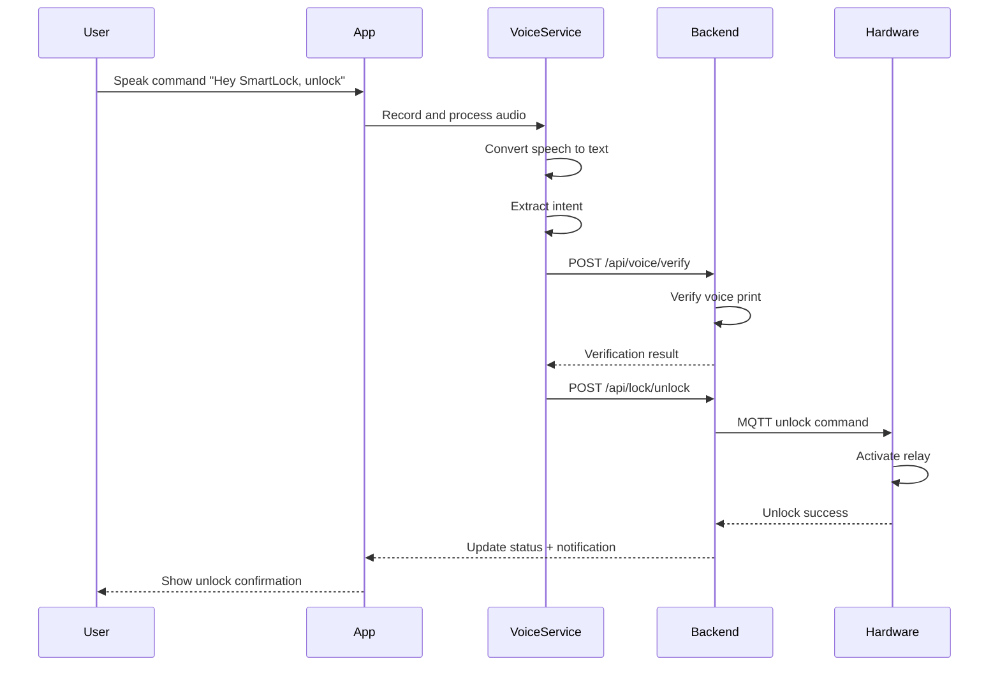
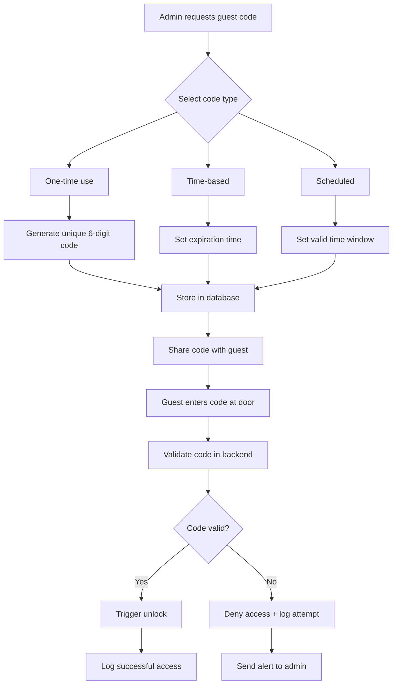

# SmartLock Pro - Complete Smart Lock System


[](https://socket.io/)
[](https://developer.mozilla.org/en-US/docs/Web/API/Web_Speech_API)
[](https://en.wikipedia.org/wiki/Multi-user)

##  Table of Contents
- [Overview](#-overview)
- [System Architecture](#-system-architecture)
- [Features](#-features)
- [Tech Stack](#-tech-stack)
- [Installation](#-installation)
- [Hardware Setup](#-hardware-setup)
- [Mobile App Setup](#-mobile-app-setup)
- [Backend Setup](#-backend-setup)
- [System Flow](#-system-flow)
- [Security Features](#-security-features)
- [Deployment](#-deployment)
- [API Documentation](#-api-documentation)
- [Troubleshooting](#-troubleshooting)
- [Contributing](#-contributing)
- [License](#-license)

##  Overview

**SmartLock Pro** is a comprehensive smart lock system that combines mobile app control, voice recognition, and remote access management. This production-ready solution provides secure, convenient, and intelligent access control for homes, offices, and shared spaces.

### Key Highlights
- **Remote Control**: Lock/unlock from anywhere in the world
- **Voice Recognition**: Hands-free operation with multi-user voice profiles
- **Access Management**: Create temporary guest codes and track all activities
- **Smart Automation**: Auto-lock, scheduling, and integration capabilities
- **Enterprise Security**: End-to-end encryption and secure communication

##  System Architecture



##  Features

###  **Core Security Features**
- **Remote Locking/Unlocking**: Control your lock from anywhere via mobile app
- **Access Logs**: Comprehensive tracking of all lock activities with timestamps and user info
- **Temporary Guest Codes**: Generate time-limited access codes for visitors/delivery
- **Auto-lock**: Automatic locking after configurable delay (30s, 1m, 5m, etc.)
- **Multi-factor Authentication**: Combine voice, PIN, and mobile verification

###  **Voice Recognition Features**
- **Multi-user Support**: Recognize different family members' voices
- **Voice Print Encryption**: Secure storage of voice profiles
- **Noise Cancellation**: Works in various environmental conditions
- **Custom Wake Words**: "Hey SmartLock", "Open Sesame", etc.
- **Offline Mode**: Basic voice commands work without internet

###  **Mobile App Features**
- **Real-time Status**: Live lock status updates
- **User Management**: Add/remove family members and guests
- **Schedule Management**: Set locking/unlocking schedules
- **Notifications**: Push notifications for all lock activities
- **Emergency Override**: Admin override in case of system failure

###  **Smart Features**
- **Geofencing**: Auto-unlock when you approach home
- **Integration Ready**: Works with Google Home, Alexa, HomeKit
- **Battery Monitoring**: Alerts for low battery on hardware
- **Backup Power**: Support for emergency power sources
- **Firmware Updates**: OTA updates for ESP32 hardware

##  Tech Stack

### **Backend Layer**


- **Runtime**: Node.js 18+ with Express.js
- **Database**: MongoDB with Mongoose ODM
- **Real-time**: Socket.IO for live updates
- **Authentication**: JWT, bcrypt for password hashing
- **Voice Processing**: Web Speech API + Custom NLP
- **Message Queue**: MQTT for hardware communication
- **Security**: Helmet, CORS, rate limiting

### **Mobile App**


- **Framework**: React Native with Expo
- **Navigation**: React Navigation 6
- **State Management**: Redux Toolkit
- **UI Components**: React Native Paper
- **Voice Processing**: Expo Audio + react-native-voice
- **Push Notifications**: Expo Notifications
- **Storage**: AsyncStorage for local data

### **Hardware**


- **Microcontroller**: ESP32-WROOM-32
- **Lock Mechanism**: 12V Solenoid Lock
- **Control**: 2-Channel Relay Module
- **Power**: 12V DC Power Supply + Battery Backup
- **Indicators**: RGB LED, Buzzer
- **Connectivity**: WiFi 802.11 b/g/n

##  Installation

### Prerequisites


```bash
# Software Requirements
- Node.js 18+ and npm/yarn
- MongoDB 5.0+ (or MongoDB Atlas)
- Python 3.8+ (for ESP32 programming)
- Arduino IDE or PlatformIO
- Expo CLI for mobile development
- Git for version control

# Hardware Requirements
- ESP32 Development Board
- 12V Solenoid Lock
- 2-Channel Relay Module
- Jumper Wires and Breadboard
- 12V DC Power Supply
- Android/iOS device for testing
```

### Quick Start
```bash
# Clone the repository
git clone https://github.com/yourusername/smartlock-pro.git
cd smartlock-pro

# Run setup script
chmod +x setup.sh
./setup.sh
```

##  Hardware Setup

### Circuit Diagram
```
┌─────────────────────────────────────────────────────┐
│                SmartLock Pro Circuit                │
├─────────────────────────────────────────────────────┤
│                                                     │
│  ESP32 Pinout:                                      │
│  ┌─────────────────────────────────────────────┐   │
│  │ GPIO16 → Relay IN1 (Lock Control)           │   │
│  │ GPIO17 → Relay IN2 (Unlock Control)         │   │
│  │ GPIO2  → RGB LED (Status Indicator)         │   │
│  │ GPIO15 → Buzzer (Audible Feedback)          │   │
│  │ 3.3V   → Relay VCC                          │   │
│  │ GND    → Relay GND                          │   │
│  └─────────────────────────────────────────────┘   │
│                                                     │
│  Power Setup:                                       │
│  ┌─────────────────────────────────────────────┐   │
│  │ 12V DC → Relay COM1 → Solenoid Lock (+)     │   │
│  │ GND    → Solenoid Lock (-)                  │   │
│  └─────────────────────────────────────────────┘   │
│                                                     │
└─────────────────────────────────────────────────────┘
```

### Hardware Assembly Steps
```bash
# 1. Install Arduino IDE or PlatformIO
# 2. Install ESP32 board support
# 3. Connect components as per circuit diagram
# 4. Upload firmware to ESP32
cd hardware/esp32-firmware
platformio run --target upload

# 5. Configure WiFi credentials
# Edit hardware/esp32-firmware/include/config.h
const char* WIFI_SSID = "Your_WiFi_SSID";
const char* WIFI_PASSWORD = "Your_WiFi_Password";
```

### Hardware Testing
```bash
# Test relay control
curl -X POST http://ESP32_IP/api/lock \
  -H "Content-Type: application/json" \
  -d '{"command":"lock"}'

# Check device status
curl http://ESP32_IP/api/status
```

##  Mobile App Setup

### Development Environment
```bash
# Install Expo CLI
npm install -g expo-cli

# Navigate to mobile app directory
cd mobile-app

# Install dependencies
npm install
# or
yarn install

# Start development server
expo start

# Run on specific platform
expo start --android
expo start --ios
expo start --web
```

### App Configuration
```javascript
// mobile-app/config/config.js
export default {
  API_URL: 'https://your-backend-url.com/api',
  SOCKET_URL: 'wss://your-backend-url.com',
  MQTT_BROKER: 'wss://mqtt.your-backend-url.com',
  
  // Voice recognition settings
  VOICE: {
    LANGUAGE: 'en-US',
    WAKE_WORDS: ['hey smartlock', 'open sesame'],
    CONFIDENCE_THRESHOLD: 0.7
  },
  
  // Security settings
  SECURITY: {
    SESSION_TIMEOUT: 30, // minutes
    MAX_LOGIN_ATTEMPTS: 5,
    AUTO_LOCK_DELAY: 30000 // milliseconds
  }
};
```

### Building for Production
```bash
# Build for Android
expo build:android

# Build for iOS (requires Apple Developer account)
expo build:ios

# Create standalone apps
expo build:android --type app-bundle
expo build:ios --type archive
```

##  Backend Setup

### Environment Configuration
```bash
cd backend
cp .env.example .env

# Edit .env file with your configuration
NODE_ENV=production
PORT=3000
MONGODB_URI=mongodb://localhost:27017/smartlock
JWT_SECRET=your-super-secret-jwt-key-change-this
MQTT_BROKER=mqtt://localhost:1883
SOCKET_PORT=3001
REDIS_URL=redis://localhost:6379
```

### Database Setup
```bash
# Start MongoDB (if using local instance)
sudo systemctl start mongod

# Create database and collections
mongo
> use smartlock
> db.createCollection('users')
> db.createCollection('access_logs')
> db.createCollection('guest_codes')
> db.createCollection('voice_profiles')

# Create indexes for performance
> db.users.createIndex({ email: 1 }, { unique: true })
> db.access_logs.createIndex({ timestamp: -1 })
> db.guest_codes.createIndex({ expiresAt: 1 }, { expireAfterSeconds: 0 })
```

### Starting the Backend
```bash
# Development mode
npm run dev

# Production mode
npm start

# With PM2 process manager
npm install -g pm2
pm2 start ecosystem.config.js

# Using Docker
docker-compose up -d
```

##  System Flow

### Authentication Flow


### Voice Unlock Flow


### Guest Code Generation Flow


##  Security Features

### Authentication & Authorization
- **JWT-based authentication** with refresh token rotation
- **Role-based access control** (Admin, Family, Guest)
- **Multi-factor authentication** options
- **Session management** with automatic logout

### Data Protection
- **End-to-end encryption** for all communications
- **Voice print encryption** using AES-256
- **Secure password storage** with bcrypt (12 rounds)
- **Database encryption** at rest

### Network Security
- **HTTPS/TLS 1.3** for all API communications
- **WebSocket over WSS** for real-time updates
- **MQTT with TLS** for hardware communication
- **Rate limiting** and DDoS protection

### Physical Security
- **Tamper detection** with accelerometer (optional)
- **Battery backup** monitoring
- **Emergency override** with physical key
- **Audit logging** of all physical interactions

##  Deployment

### Backend Deployment (Heroku)
```bash
# Create Heroku app
heroku create smartlock-pro-backend

# Add MongoDB Atlas addon
heroku addons:create mongodb:sandbox

# Configure environment variables
heroku config:set \
  JWT_SECRET=your-secret-key \
  NODE_ENV=production \
  MONGODB_URI=your-mongodb-uri

# Deploy to Heroku
git push heroku main

# Check logs
heroku logs --tail
```

### Backend Deployment (Docker)
```dockerfile
# Dockerfile
FROM node:18-alpine
WORKDIR /app
COPY package*.json ./
RUN npm ci --only=production
COPY . .
EXPOSE 3000
CMD ["node", "server.js"]
```

```bash
# Build and run
docker build -t smartlock-backend .
docker run -p 3000:3000 --env-file .env smartlock-backend

# Using Docker Compose
docker-compose up -d
```

### Mobile App Deployment
```bash
# Configure app.json for production
{
  "expo": {
    "name": "SmartLock Pro",
    "slug": "smartlock-pro",
    "version": "1.0.0",
    "orientation": "portrait",
    "icon": "./assets/icon.png",
    "splash": {
      "image": "./assets/splash.png"
    },
    "updates": {
      "fallbackToCacheTimeout": 0
    },
    "assetBundlePatterns": ["**/*"],
    "ios": {
      "supportsTablet": true,
      "bundleIdentifier": "com.yourcompany.smartlock"
    },
    "android": {
      "adaptiveIcon": {
        "foregroundImage": "./assets/adaptive-icon.png"
      },
      "package": "com.yourcompany.smartlock"
    },
    "web": {
      "favicon": "./assets/favicon.png"
    }
  }
}
```

### Production Checklist
- [ ] Enable HTTPS with SSL certificate
- [ ] Configure firewall rules
- [ ] Set up monitoring (Prometheus + Grafana)
- [ ] Implement backup strategy
- [ ] Configure CI/CD pipeline
- [ ] Set up error tracking (Sentry)
- [ ] Enable security headers
- [ ] Regular security audits

##  API Documentation

### Authentication Endpoints
```
POST   /api/auth/register     - Register new user
POST   /api/auth/login        - Login with credentials
POST   /api/auth/logout       - Logout current session
POST   /api/auth/refresh      - Refresh access token
POST   /api/auth/verify-email - Verify email address
```

### Lock Control Endpoints
```
POST   /api/lock              - Lock the door
POST   /api/unlock            - Unlock the door
GET    /api/lock/status       - Get current lock status
POST   /api/lock/auto         - Configure auto-lock settings
```

### Voice Endpoints
```
POST   /api/voice/enroll      - Enroll new voice profile
POST   /api/voice/verify      - Verify voice command
GET    /api/voice/profiles    - Get user voice profiles
DELETE /api/voice/profiles/:id - Delete voice profile
```

### Guest Management Endpoints
```
POST   /api/guest/codes       - Generate guest code
GET    /api/guest/codes       - List all guest codes
DELETE /api/guest/codes/:id   - Revoke guest code
PUT    /api/guest/codes/:id   - Update guest code
```

### Access Logs Endpoints
```
GET    /api/logs              - Get access logs
GET    /api/logs/:id          - Get specific log entry
DELETE /api/logs/old          - Clean old logs
GET    /api/logs/export       - Export logs as CSV
```

##  Troubleshooting

### Common Issues

**1. ESP32 Won't Connect to WiFi**
```bash
# Check ESP32 serial output
platformio device monitor

# Common fixes:
# 1. Check WiFi credentials in config.h
# 2. Ensure 2.4GHz network (ESP32 doesn't support 5GHz)
# 3. Check router MAC filtering
# 4. Try static IP configuration
```

**2. Mobile App Can't Connect to Backend**
```bash
# Check network configuration
ping your-backend-url.com

# Verify CORS settings in backend
# Check if HTTPS is properly configured
# Verify API endpoints are accessible

# Test with curl
curl https://your-backend-url.com/api/health
```

**3. Voice Recognition Not Working**
```bash
# Check microphone permissions on mobile
# Verify voice model is downloaded
# Test in quiet environment
# Check confidence threshold settings

# Debug voice processing
expo start --clear
```

**4. Database Connection Issues**
```bash
# Check MongoDB connection
mongo --host localhost --port 27017

# Verify connection string in .env
# Check if MongoDB service is running
sudo systemctl status mongod

# Test connection from Node.js
node -e "const mongoose = require('mongoose'); mongoose.connect('mongodb://localhost:27017/test').then(() => console.log('Connected')).catch(console.error)"
```

### Debug Mode
```bash
# Backend debug
DEBUG=smartlock:* npm run dev

# Mobile app debug
expo start --dev-client

# Hardware debug
platformio debug

# Network debug
ngrok http 3000
```

##  Contributing


We welcome contributions! Please see our [Contributing Guidelines](CONTRIBUTING.md) for details.

### Development Workflow
```bash
# 1. Fork the repository
# 2. Create a feature branch
git checkout -b feature/amazing-feature

# 3. Commit your changes
git commit -m 'Add some amazing feature'

# 4. Push to the branch
git push origin feature/amazing-feature

# 5. Open a Pull Request
```

### Code Standards
- Follow ESLint configuration
- Write unit tests for new features
- Update documentation accordingly
- Use conventional commits

##  License


This project is licensed under the MIT License - see the [LICENSE](LICENSE) file for details.

##  Important Files

### Mobile App
- **`mobile-app/services/VoiceProcessor.js`** - Handles voice recognition
- **`mobile-app/components/GuestCodes.js`** - Guest code management UI
- **`mobile-app/components/AccessLogs.js`** - Log display component
- **`mobile-app/screens/HomeScreen.js`** - Main dashboard

### Backend
- **`backend/models/User.js`** - User schema with voice profiles
- **`backend/models/AccessLog.js`** - Log schema
- **`backend/controllers/lockController.js`** - Lock control logic
- **`backend/services/voiceService.js`** - Voice processing service

### Hardware
- **`hardware/esp32-firmware/src/main.cpp`** - Main firmware
- **`hardware/esp32-firmware/include/config.h`** - Configuration
- **`hardware/esp32-firmware/lib/MQTTClient`** - MQTT communication

---

**For questions and support, please open an issue on GitHub.**  
*This project is for educational and demonstration purposes.*

*SmartLock Pro - Secure your world, intelligently.* 🔐
