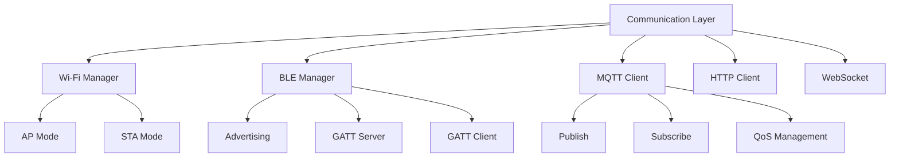
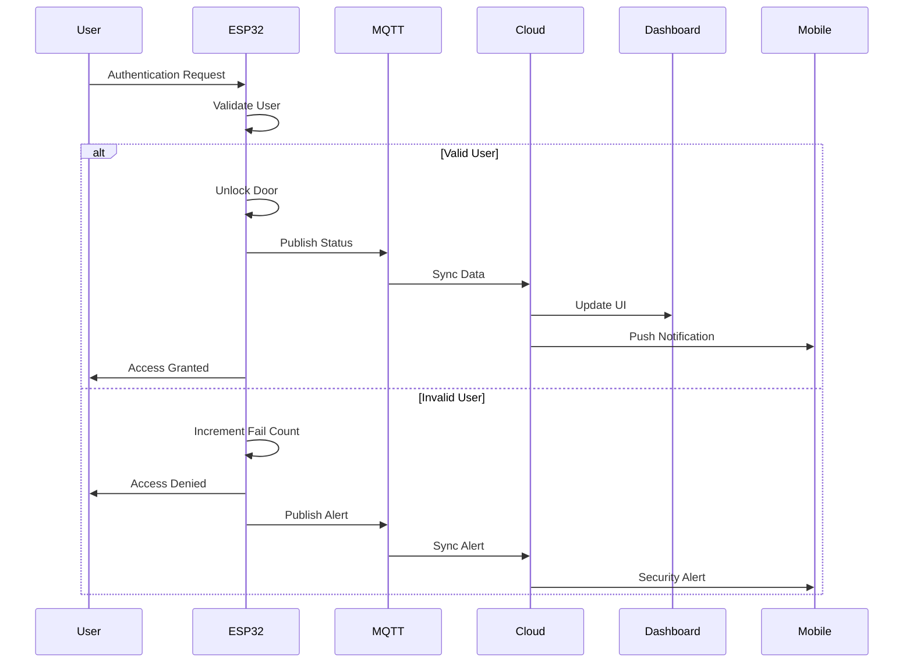

# System Architecture

## Overview

The SmartLock Pro system follows a modular, layered architecture that separates hardware control from application logic and user interfaces. This design ensures maintainability, scalability, and security.

## Architecture Layers

### 1. Hardware Abstraction Layer (HAL)

The HAL provides a uniform interface to all hardware peripherals, abstracting the underlying implementation details.

```cpp
// Example HAL Interface
class IHardware {
public:
    virtual bool init() = 0;
    virtual bool readSensor(SensorType type, float& value) = 0;
    virtual bool authenticate(AuthMethod method, void* data) = 0;
    virtual bool actuate(ActuatorType type, bool state) = 0;
    virtual bool getStatus(StatusType type, Status& status) = 0;
};
```

**Components:**
- GPIO Manager
- UART/SPI/I2C Drivers
- ADC/DAC Interface
- PWM Controller
- Touch Sensor Handler

### 2. Device Management Layer

Manages device configuration, state, and operations.

```cpp
class DeviceManager {
private:
    DeviceConfig config;
    DeviceState state;
    std::vector<User> users;
    std::vector<AccessLog> logs;
    
public:
    bool configure(const DeviceConfig& cfg);
    bool addUser(const User& user);
    bool removeUser(UserID id);
    AccessLog getLog(const TimeRange& range);
    DeviceState getState();
};
```

### 3. Communication Layer

Handles all communication protocols and data exchange.



### 4. Security Layer

Provides all security services including encryption, authentication, and authorization.

```cpp
class SecurityManager {
private:
    CryptoEngine crypto;
    KeyManager keys;
    AuthManager auth;
    AuditLogger audit;
    
public:
    bool encrypt(const uint8_t* data, size_t len, uint8_t* out);
    bool decrypt(const uint8_t* data, size_t len, uint8_t* out);
    bool authenticate(AuthMethod method, const Credentials& creds);
    bool authorize(User user, Operation op);
    void logEvent(const SecurityEvent& event);
};
```

**Security Features:**
- Secure Boot
- Flash Encryption
- Hardware Crypto Acceleration
- Secure Storage (SPIFFS with encryption)
- TLS/SSL for network communication
- Certificate-based authentication

### 5. Application Logic Layer

Core business logic implementing the smart lock functionality.

```python
# Application Logic Flow
class SmartLockApplication:
    def __init__(self):
        self.hardware = HardwareManager()
        self.auth = AuthenticationManager()
        self.lock = LockController()
        self.scheduler = Scheduler()
        self.notification = NotificationService()
    
    def handle_access_request(self, request):
        """Main access request handler"""
        # Validate request
        if not self.validate_request(request):
            return AccessResponse.denied()
        
        # Authenticate
        user = self.auth.authenticate(request)
        if not user:
            return AccessResponse.denied()
        
        # Check authorization
        if not self.auth.authorize(user, request):
            return AccessResponse.denied()
        
        # Execute access
        if self.lock.unlock():
            self.log_access(user)
            self.notify_owner(user)
            return AccessResponse.granted()
        
        return AccessResponse.error()
```

### 6. User Interface Layer

Multiple interfaces for different user roles and devices.

```
┌─────────────────────────────────────────────────────────┐
│                    USER INTERFACE LAYER                 │
├─────────────────────────────────────────────────────────┤
│                                                         │
│  ┌──────────────┐  ┌──────────────┐  ┌──────────────┐ │
│  │  Physical UI │  │  Mobile App  │  │  Web Dashboard│ │
│  │  - Keypad    │  │  - Android   │  │  - Admin      │ │
│  │  - Buzzer    │  │  - iOS       │  │  - Analytics  │ │
│  │  - LEDs      │  │  - BLE/WiFi  │  │  - Reports   │ │
│  │  - OLED      │  │  - OTP       │  │  - Monitor   │ │
│  └──────────────┘  └──────────────┘  └──────────────┘ │
│                                                         │
└─────────────────────────────────────────────────────────┘
```

## Communication Flows

### Local Operation Flow (No Internet)
```
User → Keypad/RFID/Fingerprint → ESP32 → Lock Actuation → Status LED
                ↓
            BLE Advertising
                ↓
         Mobile App (Optional)
```

### Remote Operation Flow (Internet Required)
```
Mobile App → Internet → Cloud → ESP32 (Wi-Fi) → Lock Actuation → Response
```

### MQTT-Based Flow (Recommended)
```
Device 1 → MQTT Broker → Device 2
                  ↓
              Raspberry Pi
                  ↓
           Automation Rules
                  ↓
              Web Dashboard
```

## Data Flow Diagram



## Error Handling Strategy

```cpp
enum class ErrorCode {
    SUCCESS = 0,
    HARDWARE_INIT_FAIL,
    AUTHENTICATION_FAILED,
    NETWORK_ERROR,
    STORAGE_ERROR,
    TIMEOUT,
    SECURITY_VIOLATION,
    POWER_FAILURE
};

class ErrorHandler {
public:
    static void handle_error(ErrorCode code) {
        log_error(code);
        notify_system(code);
        
        switch(code) {
            case ErrorCode::AUTHENTICATION_FAILED:
                // Track failed attempts
                // Trigger lockout if exceeded
                break;
            case ErrorCode::NETWORK_ERROR:
                // Switch to offline mode
                // Store for later sync
                break;
            case ErrorCode::SECURITY_VIOLATION:
                // Activate alarm
                // Notify owner
                break;
            default:
                // Log and continue
                break;
        }
    }
};
```

## Scalability Considerations

### Adding More Locks
```
Multiple ESP32 devices → Centralized MQTT Broker → Management Dashboard
```

### Adding More Users
```
User Database (Local + Cloud) → Scalable Storage → Fast Lookup
```

### Adding More Features
```
Modular Design → Plug-and-Play Modules → Easy Extension
```

## Deployment Options

### Option 1: Standalone (ESP32 Only)
- **Pro**: Simple, cost-effective
- **Con**: Limited features
- **Best for**: Basic installations

### Option 2: ESP32 + Raspberry Pi
- **Pro**: All features, local processing
- **Con**: More complex
- **Best for**: Advanced installations

### Option 3: ESP32 + Cloud
- **Pro**: Global access, unlimited storage
- **Con**: Internet dependency, cloud costs
- **Best for**: Enterprise solutions

## Monitoring & Logging

```python
class MonitoringService:
    def __init__(self):
        self.metrics = {
            'uptime': 0,
            'total_access_attempts': 0,
            'failed_attempts': 0,
            'successful_access': 0,
            'error_counts': {}
        }
    
    def log_event(self, event_type, data):
        timestamp = datetime.now().isoformat()
        log_entry = {
            'timestamp': timestamp,
            'type': event_type,
            'data': data
        }
        self.store.log(log_entry)
        
        # Update metrics
        self.update_metrics(event_type)
        
        # Check thresholds
        if self.should_alert(event_type, data):
            self.trigger_alert(event_type, data)
    
    def get_dashboard_data(self):
        return {
            'metrics': self.metrics,
            'recent_events': self.store.get_recent(100),
            'system_status': self.get_system_status()
        }
```

---

